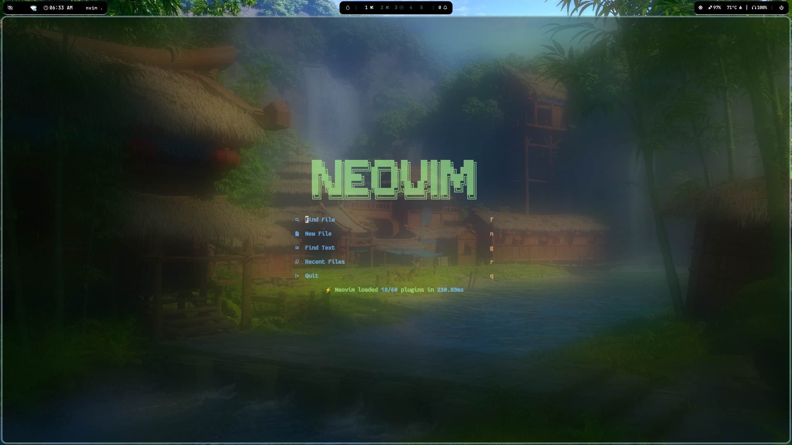
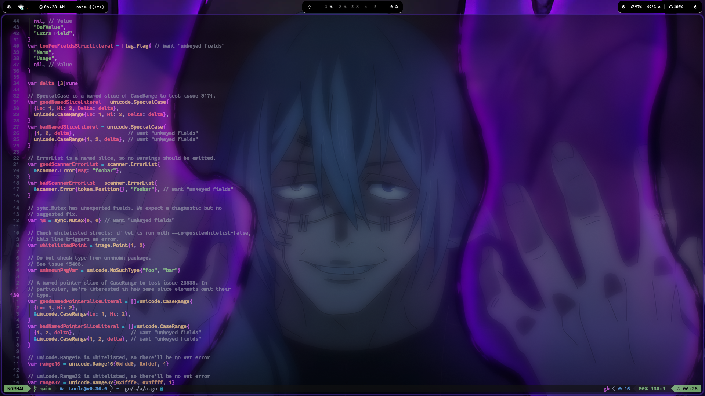
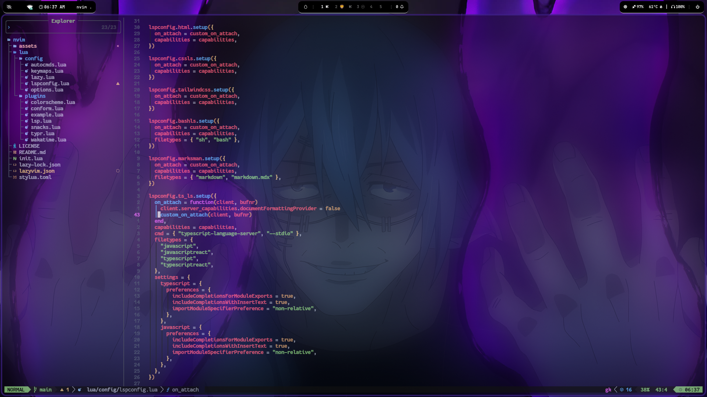
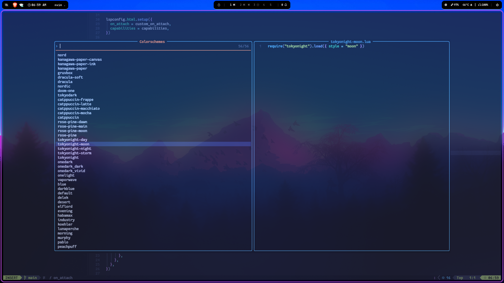

# Neovim Elite Setup ⚡

A modern, powerful, and minimal Neovim configuration tailored for developers who want performance, flexibility, and a polished workflow. This setup is based on [LazyVim](https://github.com/LazyVim/LazyVim) and further enhanced with custom plugins, key mappings, and personal touches to suit real-world engineering and red teaming tasks.

---

## 📸 Screenshots



## 🚀 Features

* **LazyVim Base**: Clean, modular configuration built on LazyVim.
* **Preconfigured Plugins**: Treesitter, LSP, Auto-completion, Formatter, and more.
* **Red Team & Engineering Tools**: Includes tools that suit development, scripting, and automation workflows.
* **Custom Keybindings**: Speed up navigation, editing, and command execution.
* **Aesthetic UI**: Theme, icons, statusline, and smooth UX out of the box.

---

## 📦 Plugins Included (Highlights)

* **Telescope** - Powerful fuzzy finder.
* **nvim-tree** - File explorer.
* **nvim-cmp** - Completion engine with snippet support.
* **LSP Config** - Preconfigured for most languages.
* **Mason** - Installer for LSPs, linters & formatters.
* **Bufferline** and **Lualine** - Tab & status lines.

> Full plugin list inside `lua/plugins/`

---

## 🔧 Installation Guide

### ⚠️ Prerequisite

Before installing this config, make sure to **backup or remove your previous Neovim configuration** to avoid conflicts:

```bash
# Backup existing config
mv ~/.config/nvim ~/.config/nvim-backup
mv ~/.local/share/nvim ~/.local/share/nvim-backup
mv ~/.local/state/nvim ~/.local/state/nvim-backup
mv ~/.cache/nvim ~/.cache/nvim-backup

# Or delete it completely (⚠️ irreversible)
rm -rf ~/.config/nvim ~/.local/share/nvim ~/.local/state/nvim ~/.cache/nvim
```

---

### 📥 Linux/macOS

```bash
# Install Neovim (v0.9+ required)
# Debian/Ubuntu
sudo apt install neovim

# Arch
sudo pacman -S neovim

# macOS (via Homebrew)
brew install neovim

# Clone the config
git clone https://github.com/ExploitEngineer/Neovim_Elite.git ~/.config/nvim

# Launch Neovim
nvim
```

### 🪟 Windows

1. Install Neovim via [scoop](https://scoop.sh/) or [Chocolatey](https://chocolatey.org/):

```powershell
scoop install neovim
# or
choco install neovim
```

2. Backup or delete old config:

```powershell
# Backup
Rename-Item "$env:LOCALAPPDATA\nvim" "$env:LOCALAPPDATA\nvim-backup"

# Or delete
Remove-Item "$env:LOCALAPPDATA\nvim" -Recurse -Force
```

3. Clone the config:

```powershell
git clone https://github.com/ExploitEngineer/Neovim_Elite.git $env:LOCALAPPDATA\nvim
```

4. Launch Neovim:

```powershell
nvim
```

> Requires Neovim v0.9+

---

## 💡 Recommended Setup

* **Font**: JetBrains Mono / FiraCode Nerd Font
* **Terminal**: Alacritty / Kitty / Windows Terminal
* **OS**: Linux / macOS preferred (WSL & Windows also supported)

---





---

## 🎨 Theme Preview

This section showcases the theme and menu customization available in Neovim Elite.



---

## 🤝 Contribute / Fork

Feel free to fork, tweak, and use this configuration as a base for your own. PRs welcome!

---

## 📜 License

MIT License

---

> Crafted with ❤️ by [ExploitEngineer](https://github.com/ExploitEngineer)
